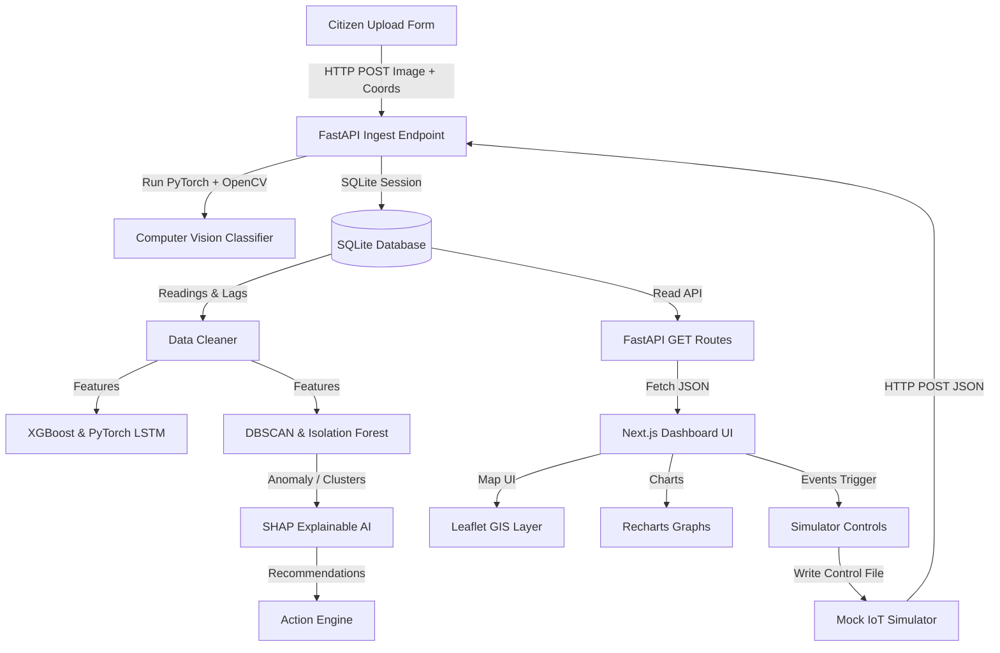
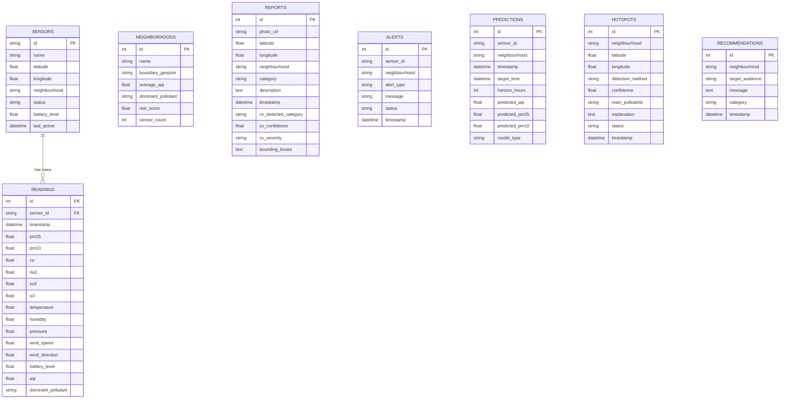

# ClearSky AI


### AI-Powered Neighbourhood Pollution Intelligence Platform
*AI-Powered Multimodal GIS Air Quality Platform for Smart Cities*

ClearSky AI is a production-quality smart city platform that combines citizen-uploaded reports, spatial-temporal IoT sensor streams, satellite multispectral grids, and computer vision classification to automatically detect hidden pollution hotspots, forecast air quality over the next 24 hours, and recommend actionable alerts for municipal dispatch.

---

## System Architecture

The decoupled system integrates deep learning classifiers, GIS rendering boundaries, and multi-agent background streams:



---

## Relational Database Schema

The database leverages SQLite for lightweight, zero-setup prototype execution:



---

## Core Intelligent Modules

### 1. Computer Vision Module (ai/vision_detector.py)
When a citizen uploads a pollution photo, the backend triggers this pipeline:
* **Deep Learning Classifier**: Passes the image tensor through a pre-trained PyTorch MobileNetV3 small network, classifying it into categories (Smoke, Dust, Waste Burning, Industrial Chimney, Traffic).
* **OpenCV Contour Analysis**: Converts the frame to HSV and extracts shape contours matching smoke (gray/diffuse) or flame (bright orange/red) spectra to output localized bounding boxes.

### 2. Satellite Multispectral Analysis (ai/satellite_analyzer.py)
Computes grid cell layers overlays:
* **NDVI (Vegetation Index)**: Maps green spectrum densities.
* **Urban Density**: Identifies concrete heat concentrations.
* **Thermal Anomalies**: Models NASA FIRMS hotspots overlaying fire detections on the interactive map.

### 3. Spatial Hotspot Detection (ai/hotspot_detector.py)
Combines:
* **DBSCAN Spatial Clustering**: Detects dense groups of poor-AQI sensors.
* **Isolation Forests**: Flags isolated point anomalies (e.g. sensor drift or sudden localized spikes).

---

## REST API Specifications

The FastAPI swagger documentation is available at http://127.0.0.1:8000/docs.

* `POST /api/report` - Accepts multipart form data containing a `photo` file, GPS coordinates, category, and description. Returns the parsed CV bounding boxes and classification.
* `GET /api/reports` - Returns citizen-reported pollution uploads.
* `GET /api/satellite` - Returns 10x10 simulated grid metadata.
* `GET /api/sensors` - Returns metadata and latest readings for 100 sensors.
* `GET /api/forecast` - Returns 24h predictions comparing XGBoost and PyTorch LSTMs.
* `GET /api/hotspots` - Returns active DBSCAN and Isolation Forest hotspots.
* `GET /api/alerts` - Returns warnings.
* `POST /api/simulator/control` - Set simulation events (Rain, Rush Hour, Construction).

---

## Installation & Setup

### Prerequisites
* **Python 3.12+**
* **Node.js 20+** with npm

### Environment Configuration
Configure a private `.env` file at the root workspace directory of the project to set the Ollama API key and cloud endpoint details:
```env
OLLAMA_BASE_URL=http://localhost:11434
OLLAMA_API_KEY=your_ollama_cloud_api_key_here
OLLAMA_MODEL=llama3
```
*Note: Do not prefix these variables with `NEXT_PUBLIC_` or `PUBLIC_NEXT_`, as they are loaded privately by the FastAPI backend server to secure credentials.*

### 1. Launch Services (FastAPI + IoT Simulator)

Navigate to the root workspace and run:
```bash
# Install dependencies
pip install -r backend/requirements.txt

# Run concurrent server orchestrator
python run_app.py
```
This boots FastAPI on port 8000 and starts the simulated neighborhood sensor stream.

### 2. Launch Next.js Dashboard
In a new console window:
```bash
cd frontend
npm install
npm run dev
```
Open http://localhost:3000 to interact with the map, toggle satellite layers, and submit reports.

---

## Future Work

1. **Physical IoT integration**: Replace the mock endpoint calls in the simulator with physical ESP32 or Arduino nodes streaming over MQTT or cellular HTTP.
2. **PostGIS Migration**: Shift from lightweight SQLite JSON GeoJSON parsed polygons to a production PostgreSQL database configured with PostGIS for true geo-spatial calculations.
3. **Refined SHAP Inference**: Cache and pre-calculate SHAP explainer objects to decrease latency on deep SHAP force plot visualisations.
